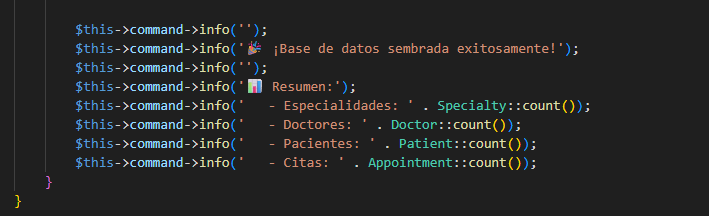
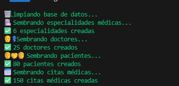
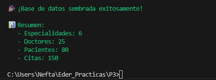

# Práctica 3 - Sistema de Citas Médicas con Laravel

## 📋 Descripción del Proyecto

Sistema completo de gestión de citas médicas desarrollado con Laravel, incluyendo migraciones, modelos con relaciones Eloquent, factories con datos realistas en español y seeders.

---

## 🗄️ Estructura de Base de Datos

### Tablas Creadas

#### 1. **Specialties** (Especialidades Médicas)
- `id` - Clave primaria
- `name` - Nombre único de la especialidad
- `description` - Descripción (nullable)
- `timestamps` - created_at, updated_at

#### 2. **Doctors** (Doctores)
- `id` - Clave primaria
- `name` - Nombre del doctor
- `lastname` - Apellidos
- `phone` - Teléfono
- `specialty_id` - Foreign key → specialties.id (CASCADE)
- `timestamps`

#### 3. **Patients** (Pacientes)
- `id` - Clave primaria
- `name` - Nombre
- `lastname` - Apellidos
- `phone` - Teléfono
- `email` - Email único
- `date_of_birth` - Fecha de nacimiento
- `timestamps`

#### 4. **Appointments** (Citas)
- `id` - Clave primaria
- `patient_id` - Foreign key → patients.id (CASCADE)
- `doctor_id` - Foreign key → doctors.id (CASCADE)
- `scheduled_at` - Fecha y hora de la cita
- `status` - ENUM: 'pending', 'confirmed', 'cancelled', 'completed'
- `notes` - Notas adicionales (nullable)
- `timestamps`
- `deleted_at` - Soft deletes

---

## 🔗 Relaciones de Eloquent

### Specialty Model
```php
public function doctors(): HasMany
{
    return $this->hasMany(Doctor::class);
}
```

### Doctor Model
```php
public function specialty(): BelongsTo
{
    return $this->belongsTo(Specialty::class);
}

public function appointments(): HasMany
{
    return $this->hasMany(Appointment::class);
}
```

### Patient Model
```php
public function appointments(): HasMany
{
    return $this->hasMany(Appointment::class);
}
```

### Appointment Model
```php
public function patient(): BelongsTo
{
    return $this->belongsTo(Patient::class);
}

public function doctor(): BelongsTo
{
    return $this->belongsTo(Doctor::class);
}
```
**Nota:** Usa `SoftDeletes` trait

---

## 🏭 Factories Implementados

### SpecialtyFactory
Genera 6 especialidades médicas reales:
- Cardiología
- Dermatología
- Pediatría
- Traumatología
- Ginecología
- Oftalmología

Cada especialidad incluye una descripción profesional en español.

### DoctorFactory
Características:
- **Nombres realistas en español** (masculinos y femeninos)
- **Apellidos compuestos** hispanos
- **Teléfonos formato México**: 55########
- **Asignación aleatoria** de especialidad

Ejemplos generados:
- Dr. Luis Torres Hernández
- Dra. Ana Mendoza Pérez
- Dr. Javier Gómez López

### PatientFactory
Características:
- **Nombres en español** (80+ opciones)
- **Apellidos hispanos** compuestos
- **Emails realistas**: usuario@gmail.com, @hotmail.com, etc.
- **Fechas de nacimiento**: Entre 80 años y 1 año atrás
- **Teléfonos formato México**

### AppointmentFactory
Características especiales:
- **Fechas**: Próximos 45 días
- **Días hábiles**: Lunes a Sábado (excluye domingos)
- **Horario**: 8:00 AM - 7:00 PM
- **Intervalos**: Cada 30 minutos
- **Estados aleatorios**: pending, confirmed, cancelled, completed
- **Notas opcionales**: 70% de probabilidad

---

## 🌱 Database Seeder

### Datos Generados

El `DatabaseSeeder` pobla la base de datos con:

| Tabla | Cantidad | Descripción |
|-------|----------|-------------|
| **Specialties** | 6 | Especialidades médicas reales |
| **Doctors** | 25 | Doctores con nombres españoles |
| **Patients** | 80 | Pacientes con datos realistas |
| **Appointments** | 150 | Citas en horarios hábiles |

### Comando de Ejecución
```bash
php artisan db:seed
```

### Salida del Seeder
```
🗑️ Limpiando base de datos...
🏥 Sembrando especialidades médicas...
✅ 6 especialidades creadas
👨‍⚕️ Sembrando doctores...
✅ 25 doctores creados
🧑‍🤝‍🧑 Sembrando pacientes...
✅ 80 pacientes creados
📅 Sembrando citas médicas...
✅ 150 citas médicas creadas

🎉 ¡Base de datos sembrada exitosamente!

📊 Resumen:
   - Especialidades: 6
   - Doctores: 25
   - Pacientes: 80
   - Citas: 150
```

---

## 📸 Capturas de Verificación

### Captura 1: Conteo de Appointments


Muestra el resultado de `Appointment::count()` retornando **150 citas** creadas exitosamente.

---

### Captura 2: Doctores con Especialidades (Primera consulta)


Consulta: `Doctor::with('specialty')->take(5)->get()`

Muestra los primeros 5 doctores con sus especialidades relacionadas, incluyendo:
- ID del doctor
- Nombre y apellidos
- Teléfono
- Especialidad completa (nombre y descripción)

---

### Captura 3: Doctores con Especialidades (Segunda consulta)


Segunda ejecución de la consulta mostrando la carga eager de relaciones funcionando correctamente.

---

## 📁 Archivos Creados/Modificados

### Migraciones
- `database/migrations/2024_01_01_000001_create_specialties_table.php`
- `database/migrations/2024_01_01_000002_create_doctors_table.php`
- `database/migrations/2024_01_01_000003_create_patients_table.php`
- `database/migrations/2024_01_01_000004_create_appointments_table.php`

### Modelos
- `app/Models/Specialty.php`
- `app/Models/Doctor.php`
- `app/Models/Patient.php`
- `app/Models/Appointment.php`

### Factories
- `database/factories/SpecialtyFactory.php`
- `database/factories/DoctorFactory.php`
- `database/factories/PatientFactory.php`
- `database/factories/AppointmentFactory.php`

### Seeders
- `database/seeders/DatabaseSeeder.php`

### Documentación
- `database_diagram.md` - Diagrama de base de datos con relaciones

---

## 🎯 Verificación de Datos

### Conteo de Registros
```
Especialidades: 6
Doctores: 25
Pacientes: 80
Citas: 150
```

### Ejemplos de Doctores con Especialidades
```
Dr. Luis Torres Hernández - Ginecología (Tel: 5551993569)
Dr. Javier Gómez López - Traumatología (Tel: 5580684372)
Dra. Ana Mendoza Pérez - Traumatología (Tel: 5542424488)
Dra. Carmen González Torres - Cardiología (Tel: 5511029640)
Dr. Fernando Pérez Pérez - Traumatología (Tel: 5528904059)
```

### Distribución por Especialidad
- Cardiología: 3 doctores
- Dermatología: 6 doctores
- Pediatría: 1 doctor
- Traumatología: 5 doctores
- Ginecología: 7 doctores
- Oftalmología: 3 doctores

---

## 🚀 Comandos Útiles

### Ejecutar Migraciones
```bash
php artisan migrate
```

### Ejecutar Seeders
```bash
php artisan db:seed
```

### Refrescar Base de Datos (Migrar + Seed)
```bash
php artisan migrate:fresh --seed
```

### Iniciar Servidor de Desarrollo
```bash
php artisan serve
```

### Acceder a Tinker
```bash
php artisan tinker
```

---

## ✅ Características Implementadas

- ✅ 4 migraciones con relaciones correctas (belongsTo, hasMany)
- ✅ 4 modelos con relaciones Eloquent bidireccionales
- ✅ Constraints UNIQUE en campos necesarios
- ✅ Foreign Keys con CASCADE delete
- ✅ SoftDeletes en tabla appointments
- ✅ Factories con datos realistas en español
- ✅ Seeder funcional con 261 registros totales
- ✅ Horarios hábiles y realistas para citas médicas
- ✅ Diagrama de base de datos documentado

---

## 👨‍💻 Autor

**Eder Nefta**  
Práctica 3 - Desarrollo de Aplicaciones Web con Laravel

---

## 📅 Fecha de Entrega

30 de Noviembre, 2025
